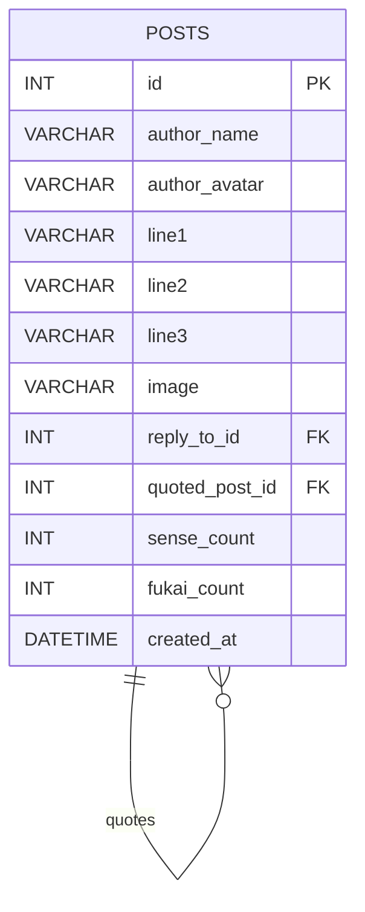
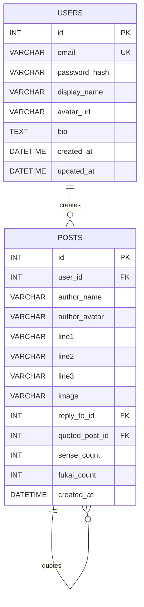
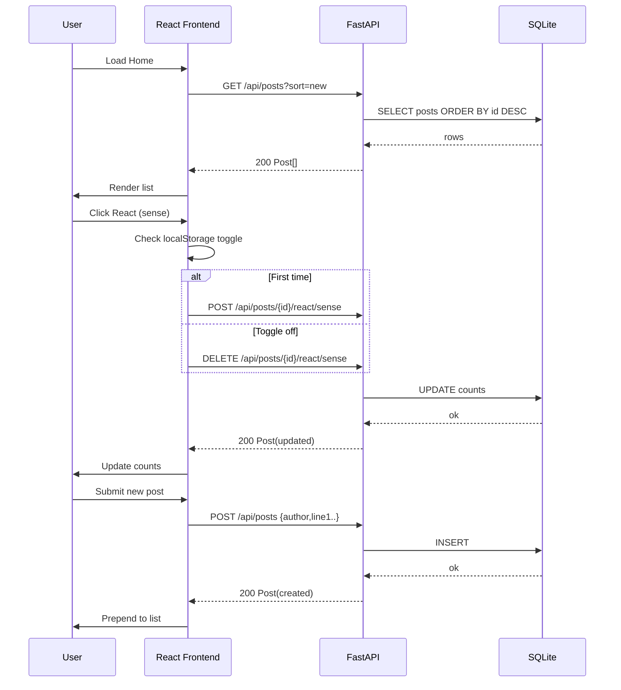
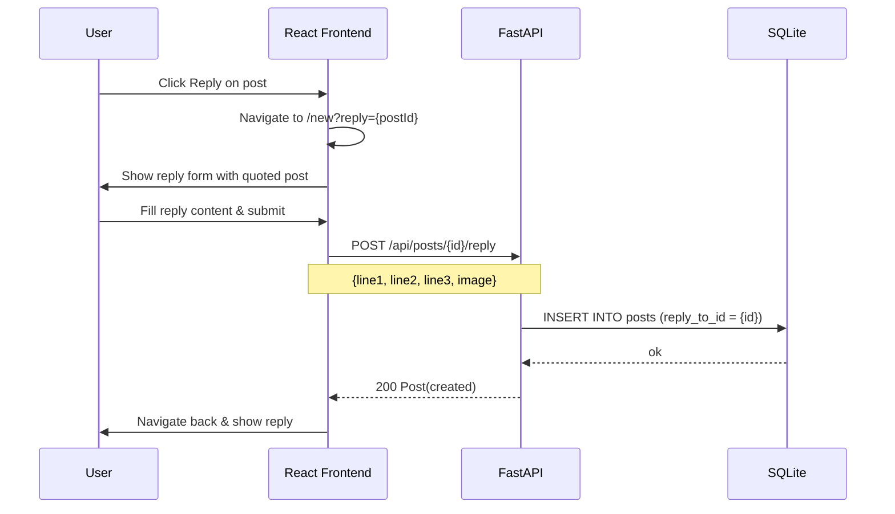
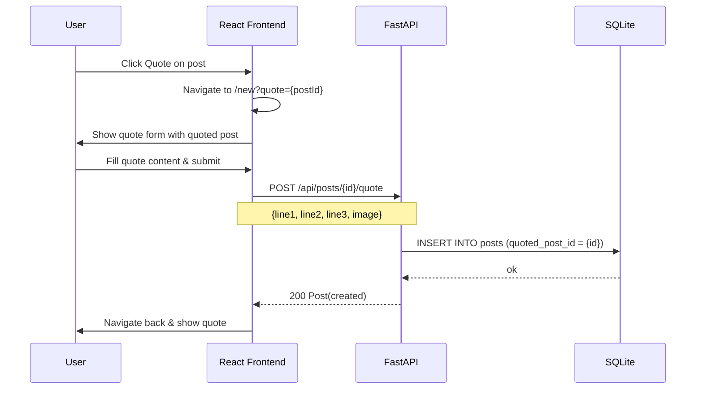
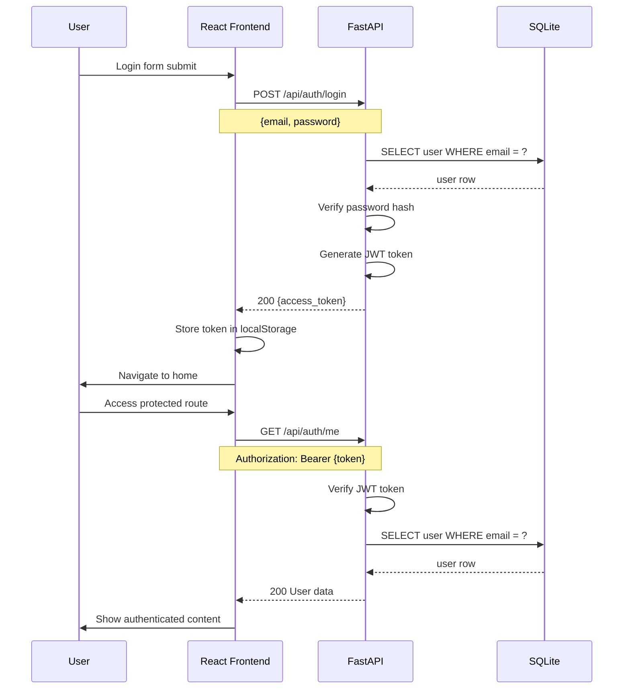
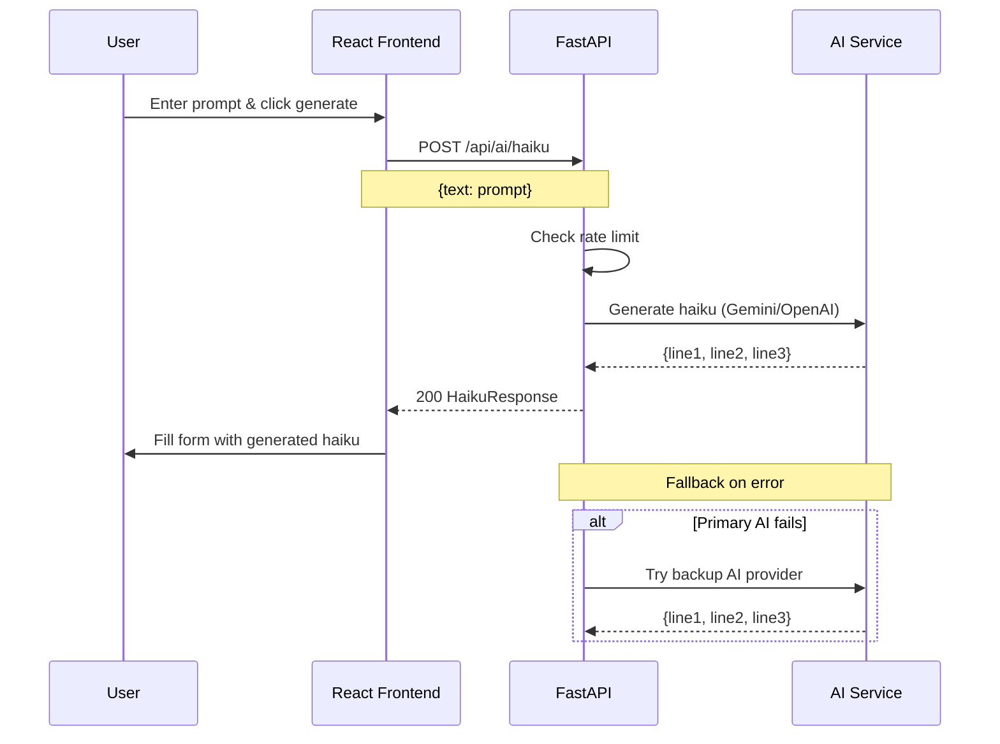
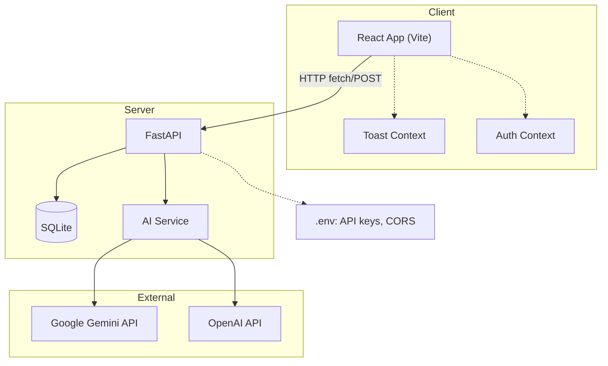

## 図版集（ER / シーケンス / アーキテクチャ）

### ER図（基本版）

```mermaid
erDiagram
  POSTS {
    INT id PK
    VARCHAR author_name
    VARCHAR author_avatar
    VARCHAR line1
    VARCHAR line2
    VARCHAR line3
    VARCHAR image
    INT reply_to_id FK
    INT quoted_post_id FK
    INT sense_count
    INT fukai_count
    DATETIME created_at
  }
  POSTS ||--o{ POSTS : replies
  POSTS ||--o{ POSTS : quotes
```

### ER図（usersテーブル追加版）

```mermaid
erDiagram
  USERS {
    INT id PK
    VARCHAR email UK
    VARCHAR password_hash
    VARCHAR display_name
    VARCHAR avatar_url
    TEXT bio
    DATETIME created_at
    DATETIME updated_at
  }
  
  POSTS {
    INT id PK
    INT user_id FK
    VARCHAR author_name
    VARCHAR author_avatar
    VARCHAR line1
    VARCHAR line2
    VARCHAR line3
    VARCHAR image
    INT reply_to_id FK
    INT quoted_post_id FK
    INT sense_count
    INT fukai_count
    DATETIME created_at
  }
  
  USERS ||--o{ POSTS : "creates"
  POSTS ||--o{ POSTS : "replies to"
  POSTS ||--o{ POSTS : "quotes"
```

### 基本フロー

```mermaid
sequenceDiagram
  participant U as User
  participant FE as React Frontend
  participant BE as FastAPI
  participant DB as SQLite

  U->>FE: Load Home
  FE->>BE: GET /api/posts?sort=new
  BE->>DB: SELECT posts ORDER BY id DESC
  DB-->>BE: rows
  BE-->>FE: 200 Post[]
  FE->>U: Render list

  U->>FE: Click React (sense)
  FE->>FE: Check localStorage toggle
  alt First time
    FE->>BE: POST /api/posts/{id}/react/sense
  else Toggle off
    FE->>BE: DELETE /api/posts/{id}/react/sense
  end
  BE->>DB: UPDATE counts
  DB-->>BE: ok
  BE-->>FE: 200 Post(updated)
  FE->>U: Update counts

  U->>FE: Submit new post
  FE->>BE: POST /api/posts {author,line1..}
  BE->>DB: INSERT
  DB-->>BE: ok
  BE-->>FE: 200 Post(created)
  FE->>U: Prepend to list
```

### 返信フロー

```mermaid
sequenceDiagram
  participant U as User
  participant FE as React Frontend
  participant BE as FastAPI
  participant DB as SQLite

  U->>FE: Click Reply on post
  FE->>FE: Navigate to /new?reply={postId}
  FE->>U: Show reply form with quoted post

  U->>FE: Fill reply content & submit
  FE->>BE: POST /api/posts/{id}/reply
  Note over FE,BE: {line1, line2, line3, image}
  BE->>DB: INSERT INTO posts (reply_to_id = {id})
  DB-->>BE: ok
  BE-->>FE: 200 Post(created)
  FE->>U: Navigate back & show reply
```

### 引用フロー

```mermaid
sequenceDiagram
  participant U as User
  participant FE as React Frontend
  participant BE as FastAPI
  participant DB as SQLite

  U->>FE: Click Quote on post
  FE->>FE: Navigate to /new?quote={postId}
  FE->>U: Show quote form with quoted post

  U->>FE: Fill quote content & submit
  FE->>BE: POST /api/posts/{id}/quote
  Note over FE,BE: {line1, line2, line3, image}
  BE->>DB: INSERT INTO posts (quoted_post_id = {id})
  DB-->>BE: ok
  BE-->>FE: 200 Post(created)
  FE->>U: Navigate back & show quote
```

### 認証フロー

```mermaid
sequenceDiagram
  participant U as User
  participant FE as React Frontend
  participant BE as FastAPI
  participant DB as SQLite

  U->>FE: Login form submit
  FE->>BE: POST /api/auth/login
  Note over FE,BE: {email, password}
  BE->>DB: SELECT user WHERE email = ?
  DB-->>BE: user row
  BE->>BE: Verify password hash
  BE->>BE: Generate JWT token
  BE-->>FE: 200 {access_token}
  FE->>FE: Store token in localStorage
  FE->>U: Navigate to home

  U->>FE: Access protected route
  FE->>BE: GET /api/auth/me
  Note over FE,BE: Authorization: Bearer {token}
  BE->>BE: Verify JWT token
  BE->>DB: SELECT user WHERE email = ?
  DB-->>BE: user row
  BE-->>FE: 200 User data
  FE->>U: Show authenticated content
```

### AI生成フロー

```mermaid
sequenceDiagram
  participant U as User
  participant FE as React Frontend
  participant BE as FastAPI
  participant AI as AI Service

  U->>FE: Enter prompt & click generate
  FE->>BE: POST /api/ai/haiku
  Note over FE,BE: {text: prompt}
  BE->>BE: Check rate limit
  BE->>AI: Generate haiku (Gemini/OpenAI)
  AI-->>BE: {line1, line2, line3}
  BE-->>FE: 200 HaikuResponse
  FE->>U: Fill form with generated haiku

  Note over BE,AI: Fallback on error
  alt Primary AI fails
    BE->>AI: Try backup AI provider
    AI-->>BE: {line1, line2, line3}
  end
```

### アーキテクチャ図

```mermaid
graph TD
  subgraph Client
    FE["React App (Vite)"]
    TC["Toast Context"]
    AC["Auth Context"]
  end
  subgraph Server
    BE["FastAPI"]
    DB[("SQLite")]
    AI["AI Service"]
  end
  subgraph External
    GM["Google Gemini API"]
    OA["OpenAI API"]
  end
  
  FE -->|"HTTP fetch/POST"| BE
  BE --> DB
  BE --> AI
  AI --> GM
  AI --> OA
  
  FE -.-> TC
  FE -.-> AC
  
  ENV[".env: API keys, CORS"]
  BE -.-> ENV
```

