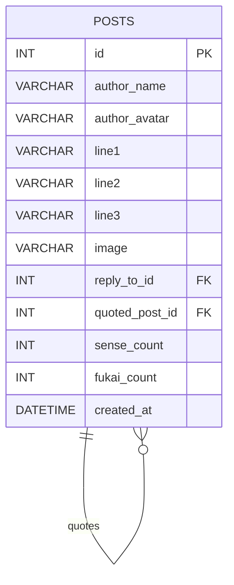
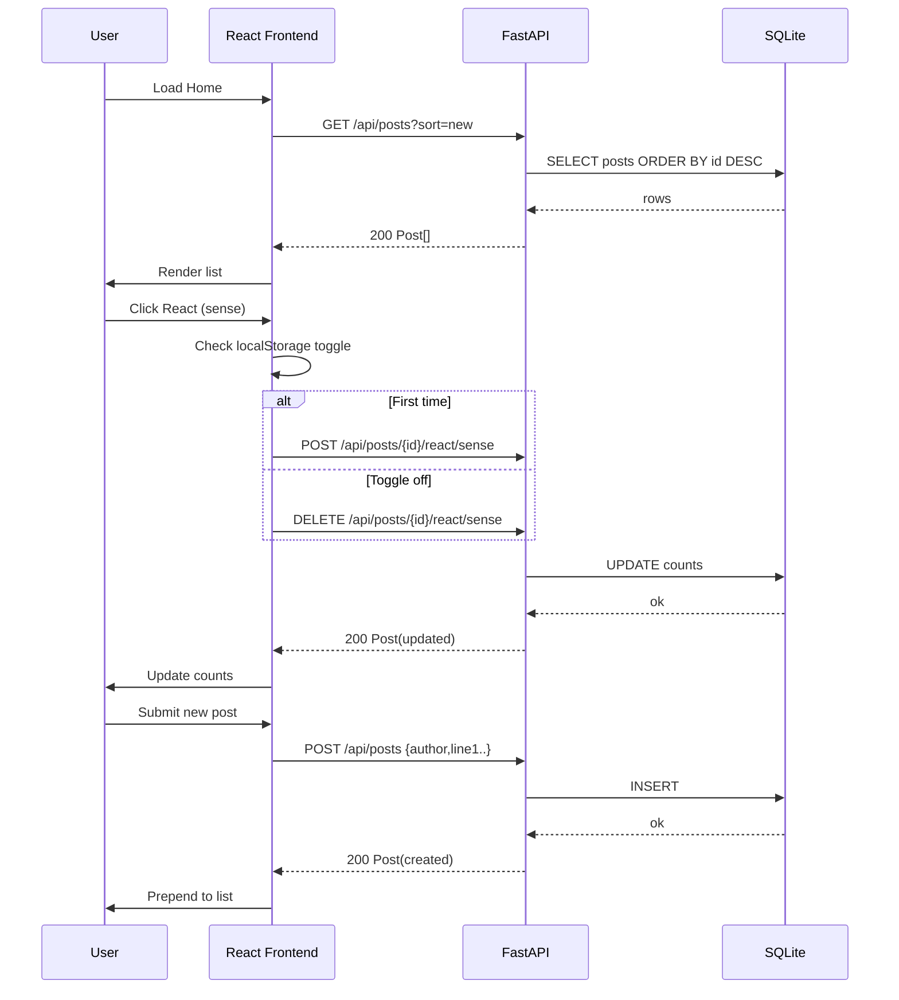
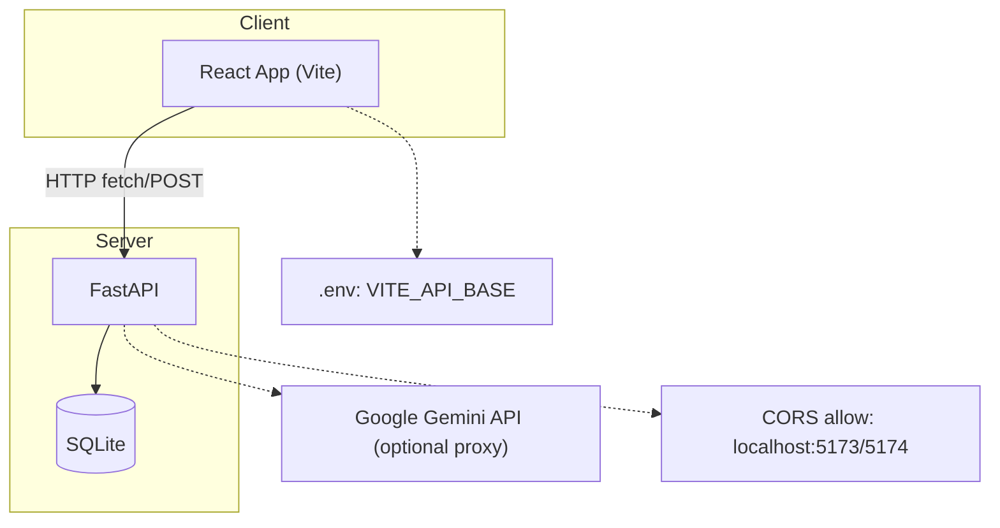

## 図版集（ER / シーケンス / アーキテクチャ）

### ER図

```mermaid
erDiagram
  POSTS {
    INT id PK
    VARCHAR author_name
    VARCHAR author_avatar
    VARCHAR line1
    VARCHAR line2
    VARCHAR line3
    VARCHAR image
    INT reply_to_id FK
    INT quoted_post_id FK
    INT sense_count
    INT fukai_count
    DATETIME created_at
  }
  POSTS ||--o{ POSTS : replies
  POSTS ||--o{ POSTS : quotes
```

### 時系列フロー

```mermaid
sequenceDiagram
  participant U as User
  participant FE as React Frontend
  participant BE as FastAPI
  participant DB as SQLite

  U->>FE: Load Home
  FE->>BE: GET /api/posts?sort=new
  BE->>DB: SELECT posts ORDER BY id DESC
  DB-->>BE: rows
  BE-->>FE: 200 Post[]
  FE->>U: Render list

  U->>FE: Click React (sense)
  FE->>FE: Check localStorage toggle
  alt First time
    FE->>BE: POST /api/posts/{id}/react/sense
  else Toggle off
    FE->>BE: DELETE /api/posts/{id}/react/sense
  end
  BE->>DB: UPDATE counts
  DB-->>BE: ok
  BE-->>FE: 200 Post(updated)
  FE->>U: Update counts

  U->>FE: Submit new post
  FE->>BE: POST /api/posts {author,line1..}
  BE->>DB: INSERT
  DB-->>BE: ok
  BE-->>FE: 200 Post(created)
  FE->>U: Prepend to list
```

### アーキテクチャ図

```mermaid
graph TD
  subgraph Client
    FE["React App (Vite)"]
  end
  subgraph Server
    BE["FastAPI"]
    DB[("SQLite")]
  end
  FE -->|"HTTP fetch/POST"| BE
  BE --> DB
  BE -.-> GM["Google Gemini API (optional proxy)"]
  ENV[".env: VITE_API_BASE"]
  CORS["CORS allow: localhost:5173/5174"]
  FE -.-> ENV
  BE -.-> CORS
```

